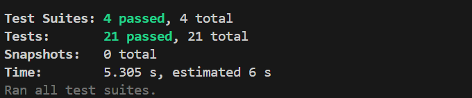
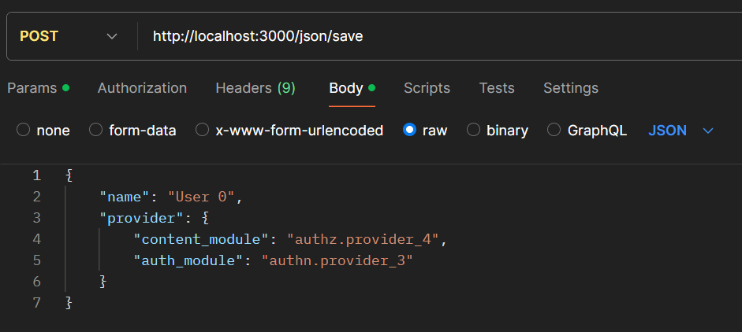

# Modularize

## Índice

- [Presentación del proyecto](#presentación-del-proyecto)
- [Problema resuelto](#problema-resuelto)
- [Tecnologías utilizadas](#tecnologías-utilizadas)
- [Manual de instalación (normal)](#manual-de-instalación-normal)
- [Manual de instalación (docker)](#manual-de-instalación-docker)
- [Pruebas con Postman](#pruebas-con-postman)
- [Ideas para el futuro](#ideas-para-el-futuro)

## Presentación del proyecto

Modularize es una solución para poder analizar el uso de módulos utilizados por usuarios; la idea es recibir archivos JSON que describan que un usuario en específico utiliza ciertos módulos, y a partir de esa información poder sacar datos, por ejemplo, dado un módulo qué usuarios lo utilizan, o conocer el mínimo conjunto de usuarios que utilizan todos los módulos.

## Problema resuelto

El proyecto aborda el desafío de gestionar archivos JSON de manera eficiente, permitiendo a los usuarios cargar los archivos y poder consultarlos.
Esta primera versión de la aplicación consta de dos funcionalidades:

1. El usuario debe ser capaz de obtener un reporte de qué usuarios utilizan los módulos correspondientes; es decir, dado un módulo, la lista de usuarios que utilizan dicho módulo.\
Para lograr esto, se recibe el JSON con la información correspondiente y se parsea los datos del JSON a un objeto de tipo "userModule" que contiene el nombre del usuario y la lista de proveedores que utiliza. El objeto se guarda en una lista en memoria que posteriormente es recorrida para generar este reporte.

2. El usuario debe ser capaz de obtener el conjunto mínimo de usuarios que utilizan todos los módulos.\
Para generar este conjunto, trabajamos nuevamente sobre la lista de userModules ya cargada en el sistema, la idea es obtener la lista de proveedores del sistema, y posteriormente recorrer, por cada usuario, ir borrando de esa lista si el mismo utiliza ese proveedor, así hasta encontrar el conjunto necesario.

Se tuvo en cuenta la reutilización del código, por lo cual vemos una clara separación de responsabilidades; tenemos "routes" que son las que redirigen al usuario al momento de hacer una solicitud al servidor y van directamente contra los "controllers", o sea, no acceden directamente a la implementación, lo cual beneficia mucho la modificabilidad. También se utilizaron interfaces lo cual beneficia la abstracción y polimorfismo. Tenemos una aplicación con bajo acoplamiento, los cual nos permite seguir agregando funcionalidades y, más importante, modificar las ya existentes sin impactar directamente módulos de niveles más altos, como el frontend.

También, para asegurar un correcto funcionamiento, se realizaron tests unitarios (no se realizó TDD, pero se probó la mayor parte del código).

Por último, comentar que se utilizó docker para poder desplegar la aplicación, más adelante se encuentra un manual de instalación para poder utilizar dicha tecnología.

## Tecnologías utilizadas

### Backend

- **Node.js**: Entorno de ejecución para construir el backend de la aplicación.
- **JEST**: Framework de pruebas.

- **ESLint**: Herramienta para garantizar la calidad y consistencia del código JavaScript.

### Frontend

- **Next.js**: Framework para React que permite la renderización del lado del servidor y optimización de la experiencia del usuario.
- **ESLint**: Herramienta para asegurar la calidad del código en el frontend.

Nota: El frontend, al no ser la prioridad de este proyecto, fue realizado mayormente con IA, específicamente v0, con el fin de entregar rápidamente un producto funcional.

## Manual de instalación (normal)

1. **Clona el repositorio**:
   ```bash
   git clone https://github.com/anthonyrafaelnu/Modularize.git
2. **Instala las dependencias**:\
(Parado tanto en el back como en el front)
    ```bash
    npm install
4. **Inicia la aplicación**:\
(Parado tanto en el back como en el front)
    ```bash
    npm run dev
El servidor se iniciará en: [localhost:3000](http://localhost:3000)\
El cliente se iniciará en: [localhost:3005](http://localhost:3005)
## Manual de instalación (docker)
1. **Clona el repositorio**:
   ```bash
   git clone https://github.com/anthonyrafaelnu/Modularize.git
2. **Ejecuta el docker compose**
   ```bash
   docker-compose -f docker-hub-compose.yml up
El servidor se iniciará en: [localhost:3000](http://localhost:3000)\
El cliente se iniciará en: [localhost:3005](http://localhost:3005)
## Pruebas con Postman
Se pueden realizar pruebas para obtener la salida de los reportes en postman.
Ejemplo:

- http://localhost:3000/json/save

- http://localhost:3000/json/moduleRegistry (Reporte de módulos)
- http://localhost:3000/json/userSet (Reporte de conjuntos de usuarios)
## Ideas para el futuro

- Implementar una funcionalidad que permita a los usuarios ver los archivos JSON cargados desde el frontend y tener opciones para eliminarlos o modificarlos.
- Mejorar la interfaz de usuario para una experiencia más intuitiva.
- Añadir soporte para otros formatos de archivo (por ejemplo, XML o CSV).
- Permitir que, al cargar un archivo, se pueda actualizar el seridor sin necesidad de reiniciar el backend.